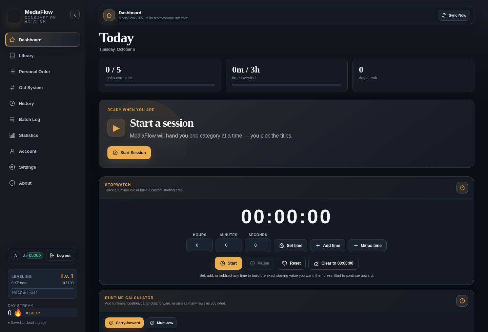
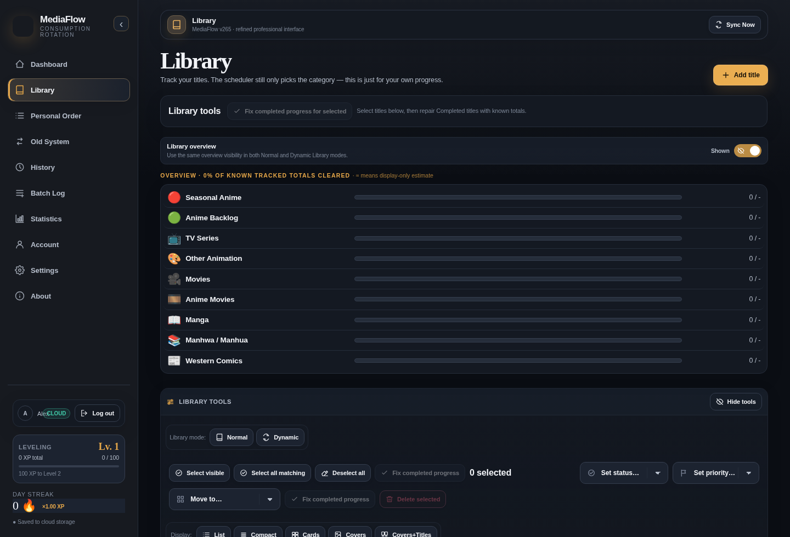
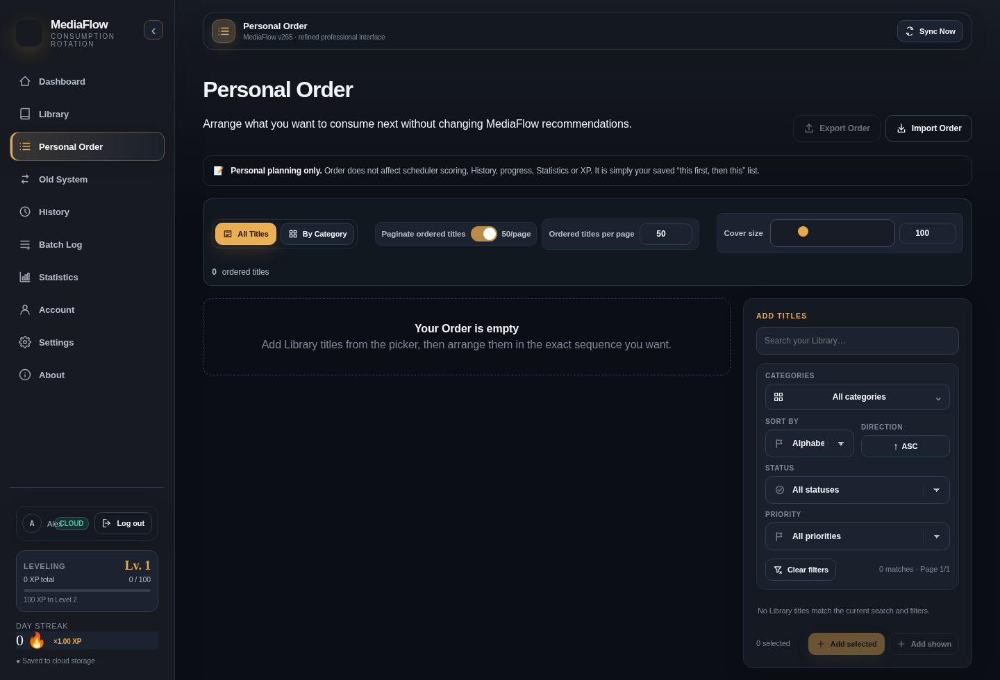

# MediaFlow

**Personal media management, tracking, planning, and analytics — by Alex Godly.**

[](./VERSION)


> **MediaFlow v370 — Personal Edition (development release candidate).** A complete media-management workspace for organizing anime, manga, manhwa, manhua, films, TV series, books, novels, comics, and other media, tracking consumption and progress, planning what to enjoy next, and understanding your activity over time.

**Website:** https://alexgodly.github.io/MediaFlow/  
**Repository:** https://github.com/AlexGodly/MediaFlow  
**Creator:** Alex Godly  
**Current source package:** v370 · October 10, 2026. **Currently deployed website:** remains on v368 until the owner deploys.

> **Historical release notice (v330):** v330 is a version-only re-release of the **v301 personal application**, not a continuation of the Community code in v329. No new user-facing feature, redesign, or data migration was introduced. The v302–v329 Community branch is archived/on hold; its public/social features are **not included** in v330. The website may show an older version until the v330 files are deployed.

**v370 release notes and validation:** [docs/CHANGELOG_v370.md](docs/CHANGELOG_v370.md). Earlier evolution sections below are historical and may use their original version numbers.

---

## Contents

1. [Overview](#overview)
2. [Release status and development direction](#release-status-and-development-direction)
3. [Feature overview](#feature-overview)
4. [Supported media and categories](#supported-media-and-categories)
5. [Getting started](#getting-started)
6. [How to use MediaFlow](#how-to-use-mediaflow)
7. [Installation and deployment](#installation-and-deployment)
8. [Technologies and programming languages](#technologies-and-programming-languages)
9. [Architecture and project structure](#architecture-and-project-structure)
10. [Data model, synchronization, and backups](#data-model-synchronization-and-backups)
11. [Configuration and development](#configuration-and-development)
12. [Compatibility, limitations, and troubleshooting](#compatibility-limitations-and-troubleshooting)
13. [Release v330 — technical changelog](#release-v330--technical-changelog)
14. [The complete MediaFlow evolution](#the-complete-mediaflow-evolution)
15. [Project roadmap and Community hiatus](#project-roadmap-and-community-hiatus)
16. [Project ownership and contact](#project-ownership-and-contact)

---

## Overview

MediaFlow is a personal media workspace built to unify **collection management, progress tracking, viewing/reading schedules, consumption records, recommendations, and analytics**. Instead of maintaining separate trackers for different types of entertainment, the application organizes them under customizable Categories, statuses, priorities, and personal workflows.

The application is intended to support a large and diverse Library. It provides compact and cover-focused views, fine-grained filters, personalized ordering, fast logging, backup/export tools, cloud synchronization, and a responsive interface. Several performance improvements across its development history specifically target Libraries containing tens of thousands of titles; **50,000 titles is an engineering target, not a published guarantee for every device**.

### At a glance

| Area | What MediaFlow provides |
| --- | --- |
| **Library** | Add, edit, organize, search, sort, filter, rate, and track media titles |
| **Dashboard** | Recommendations, activity indicators, rerolls, shortcuts, stopwatch, and runtime calculator |
| **Personal Order** | Plan consumption using ordered titles, Categories, and Collection queues |
| **Batch Log** | Record and manage media progress in bulk |
| **History** | Consumption records, recent activity, ratings, previous Library activity, and export controls |
| **Statistics** | Completion, time, media mix, activity trends, XP, streaks, and other personal insights |
| **Collections** | Curate groups of existing Library titles with multiple browsing modes |
| **Old System** | Maintain the application's earlier category-balance and conversion workflow |
| **Account & Settings** | Personal appearance, categories, preferences, authentication, cloud protection, backups, and updates |
| **Platform** | Responsive website and installable Progressive Web App where supported |

### Interface previews

These are screenshots retained in the source repository from earlier personal releases; they illustrate the interface and may not represent every minor v330 setting or theme.

| Dashboard | Library |
| --- | --- |
|  |  |

| Personal Order | Current Rerolls |
| --- | --- |
|  |  |

---

## Release status and development direction

### v330: personal application

MediaFlow v330 adopts the complete feature baseline of **v301**. This is a purposeful return to the personal application after an experimental Community-development period. It preserves the accepted personal experience and updates only the release identifiers and resources necessary to publish it as v330.

- **Personal functionality:** active development baseline, preserved from v301.
- **Community/public features (v302–v329):** on hold indefinitely and excluded from the current frontend.
- **Backend/schema migration for v330:** none.
- **Cloud Sync and local data formats:** inherited, unchanged.
- **Production deployment:** packaging a release does not itself update GitHub Pages or a user's installed PWA.

### Why Community is on hold

MediaFlow's Community experiments explored public profiles, title discovery, social connections, shared Collections, ratings, rankings, and cross-user analytics. Operating those features as a dependable public service requires more than implementing their interfaces. Appropriate **hosting capacity, database performance, security, backups, monitoring, bandwidth, and ongoing maintenance** may carry recurring costs.

For now, the priority is a **high-quality personal experience** rather than expanding public functionality before the desired infrastructure and budget are available. Community has **not been permanently cancelled**; a return may be considered when the hosting, database architecture, operational resources, and service quality can support it properly. No public relaunch date has been announced.

This is a product-scope decision. Existing Community experiments remain part of MediaFlow's development history, but they are **not runtime dependencies of v330**.

---

## Feature overview

### 1. Dashboard and recommendations

The Dashboard brings frequently used information and actions into one workspace:

- Personalized recommendations selected from eligible Library entries.
- Current recommendation with cover artwork, title details, and quick logging/opening actions.
- Recommendation rerolls with history, selection controls, and **Respect**-related information.
- Title progress and current media status where applicable.
- Activity and progression indicators such as XP, Level, streak, and personal balance insights.
- **On This Day** views and historical consumption highlights when enabled.
- **Rate Your Library** and **Missing Covers** workflows for maintaining data quality.
- A **Stopwatch** and **Runtime Calculator**, with settings to show or hide the available Dashboard utilities.

**v330 note:** The Current Rerolls dialog uses the v301 layout/scrolling repair. Its list remains usable with mouse, touch, and keyboard input, including narrow screens and long title names. The underlying recommendation rules were not changed for v330.

### 2. Library management

A centralized home for media entries, whether currently consumed, planned, paused, completed, or dropped.

- Add and edit titles and their metadata.
- Assign Category, Status, Priority, rating, and progress.
- Store title cover URLs and available imported identifiers/details.
- Search, sort, filter, and paginate large lists.
- Use **Normal** and **Dynamic** Library layouts.
- Switch among **List**, **Compact**, **Cards**, **Covers**, and **Covers+Titles** views.
- Filter by Category, Status, Priority, rating, and available/missing cover as supported by the selected view.
- Customize cover dimensions and eligible cover overlays (Category, Status, rating, progress bar).
- Inspect Title Details, update progress, and use bulk-management controls.
- Use Library-history and deleted-title recovery facilities where available.

**Seasons View:** supported titles can contain individual season names/numbers, progress, and total units. Aggregate progress and season-aware logging are available in the corresponding editors.

### 3. Custom Categories, statuses, and priorities

Categories define how your own Library is organized. MediaFlow does not require everyone to use a universal category taxonomy.

- Create, rename, reorder, enable/disable, and customize Categories.
- Choose a built-in MediaFlow Category icon, supported image URL, or emoji.
- Configure Category colors and relevant media settings (such as tracking units, minutes per unit, targets, and weights).
- Recover missing default Categories or restore the most recently deleted Category through designed confirmation dialogs.
- Reorder and adjust the visibility of relevant Category, Status, and Priority controls in Settings.
- Use the same Categories across Library, Personal Order, History, statistics, and logging.

### 4. Media logging and Batch Log

Logging is the record of actual consumption: episodes watched, chapters read, time spent, or other Category-defined units.

- Record consumed amounts or update to a final progress value using the applicable logging mode.
- Log the currently recommended title or search for another title.
- Support season/episode selection for media using Seasons View.
- Maintain session dates and relevant duration information.
- View and edit recorded activity in History.
- Use Batch Log to work with multiple Library titles and relevant filters.
- Keep logging separate from simply adding an entry to the Library.

### 5. Personal Order and planning

Personal Order provides structured control over what to consume next.

- Create an ordered queue across Categories and individual titles.
- Assign priorities and reorder using supported manual and numeric position controls.
- Use title/Category views and available sorting or filtering controls.
- Add existing **Collections as live queue references**, including mixed queues of direct titles and Collection blocks.
- Configure eligible Collection behavior (such as matching the task Category and handling completed titles).
- Advance a Collection queue as recommended titles are actually logged.
- Open assigned Collections directly and inspect their live title lists.
- Import and export supported Personal Order data (format **v5**).

### 6. Collections

Collections are curated groups of existing Library entries, not a second global catalog.

- Create, edit, describe, and organize personal Collections.
- Set custom covers or use available automatic cover collages.
- Browse Collections in different supported views, including cover- and card-oriented layouts.
- Search, sort, filter, and adjust cover sizes for Collection contents.
- Inspect Collection progress and completion information.
- Assign Collections to Personal Order when desired.
- Transfer Collections using the supported **v2** import/export format.

**Personal Edition:** Community publishing, subscriptions, and public Collection discovery introduced after v301 are not included in v330.

### 7. History and activity review

The unified History interface brings related activity views together. Depending on the selected tab, users can inspect:

- **Consumption History:** time-grouped records and activity summaries.
- **Recently Viewed:** recent title activity based on available timestamps.
- **Ratings:** title-rating activity.
- **Logs:** a more traditional paginated session log with filters, selection, editing, and export.
- **Library:** the Library's historical changes and supported recovery information.

Available controls include date and Category filters, pagination, custom range selections, CSV exports, title artwork, and batch-selection tools. Historical entries are personal account data, not a public social feed.

### 8. Statistics, progression, and achievements

MediaFlow can analyze the data already recorded in your Library and History:

- Library breakdowns by Category and Status.
- Progress, completed titles, and consumption volume.
- Ratings and selected title metrics.
- Tracked time and relevant historical trends.
- Monthly recaps, activity heatmaps, and completion timelines.
- XP, Level, streak, achievements, and supported reward configuration.
- Category balance and activity insights.

Some metrics rely on accurate manual logging, configured tracking units, or imported metadata; they should not be mistaken for externally verified watch/read history.

### 9. Old System

The Old System preserves an earlier MediaFlow workflow for Category-based management and consumption conversions. It includes **System**, **View**, and **Stats** modes and retains its underlying personal data and settings. It exists alongside the current Library, Order, and History experiences for continuity with older workflows.

### 10. Appearance, customization, and accessibility

- Theme collections with dark, light, and other supported appearance modes.
- Cover-driven dynamic themes and Full Style themes.
- Theme-aware cards, typography, modal dialogs, navigation, and controls.
- Customizable Category icons and colors.
- Responsive desktop, tablet, and phone navigation; compact mobile layouts.
- Adjustable cover sizes and relevant view preferences.
- Keyboard-focused and touch-friendly interactions in supported dialogs.
- Settings search and organized Settings navigation.
- Responsive **More** navigation at smaller widths.

### 11. Cloud Sync, offline workflows, and exports

- Account-based synchronization with Supabase.
- Local application cache and supported offline workflows.
- Explicit **Sync Now** controls and cloud-state verification/protection routines.
- Full Data export/import and Automatic Backup.
- Settings-only preset export/import.
- Personal Order and Collections import/export.
- CSV History exports and supported external-service imports.
- Version and PWA update diagnostics.

**Important:** Cached/offline application access is not the same as guaranteed offline authentication or instantaneous server synchronization. Unsynced changes are not yet available on another device.

---

## Supported media and categories

MediaFlow's categories are configurable rather than hard-coded to a single catalog type. The v301/v330 fresh-account baseline includes these **22 default Categories**:

| # | Default Category | # | Default Category |
| ---: | --- | ---: | --- |
| 1 | Seasonal Anime | 12 | Movies Backlog |
| 2 | Missed Anime | 13 | Books |
| 3 | Finished Anime | 14 | Books Backlog |
| 4 | Anime Movies | 15 | Novels |
| 5 | Asian Comics | 16 | Novels Backlog |
| 6 | Movies | 17 | Magazines |
| 7 | TV Series | 18 | Magazines Backlog |
| 8 | Anime Backlog | 19 | Online Media |
| 9 | Anime Movies Backlog | 20 | Online Media Backlog |
| 10 | Asian Comics Backlog | 21 | Comics |
| 11 | TV Series Backlog | 22 | Comics Backlog |

The default pack includes bundled Category icon artwork under [`assets/category-icons/`](./assets/category-icons/). You can adapt these Categories, change their order or labels, create your own, and choose appropriate units such as episodes, chapters, volumes, or time as supported by the Category configuration. Existing accounts keep their personal settings instead of being overwritten by fresh-account defaults.

---

## Getting started

### Use the hosted application

1. Open **[MediaFlow](https://alexgodly.github.io/MediaFlow/)** in a modern browser.
2. Sign in to an existing account or register where sign-up is available.
3. Check the displayed version in **About / Version & updates**; the live website does not necessarily update at the same time a release ZIP is produced.
4. On a new account, inspect the default Categories under **Settings → Categories**.
5. Add or import titles into **Library**.
6. Set Category, Status, Priority, progress, and any title information you want to track.
7. Log a session from Dashboard or Batch Log to begin building activity History and Statistics.
8. Use **Sync Now** when you want to confirm that the latest state has reached your account's cloud storage.
9. Create a **Full Data backup** before large imports, bulk edits, or migrations.

### Use the downloaded source locally

A local web server is recommended. Opening `index.html` as `file://` may prevent service workers, authentication redirects, or some browser APIs from working correctly.

**Python 3 (from the repository root):**

```bash
python -m http.server 8080
```

Open `http://localhost:8080/`.

The repository also includes convenience launchers:

```bash
# macOS / Linux
bash scripts/serve.sh
```

```bat
REM Windows
scripts\serve.bat
```

The application frontend is prebuilt, so **Node.js and npm are not required simply to serve or deploy the packaged website**. Signing in and Cloud Sync still require a reachable, configured Supabase project.

---

## How to use MediaFlow

This section describes a practical personal workflow using the v330 feature baseline.

### A. Build your Library

1. Open **Library** and use the add-title control.
2. Enter the title name and select the appropriate Category.
3. Set the current Status (for example, Watching, Completed, On Hold, Dropped, or Plan to Watch).
4. Optionally set Priority, cover URL, total units, progress, rating, dates, and available metadata.
5. Save the title. It becomes available to search, filter, order, log, and use in Collections.
6. Repeat or use a supported media-service import to populate many entries.

**Recommendation:** import or add a small sample first so you can confirm that Category mapping, units, and metadata match your preferences before importing a large Library.

### B. Track progress and consumption

1. Choose a title from Dashboard, Library, or the logging search.
2. Enter the consumed amount or final progress according to the active logging mode.
3. Select a Season/Episode where that option applies.
4. Confirm the log and review the updated title progress.
5. Open **History** to find the recorded session, inspect related activity, or correct a log where editing is supported.

Updating a title's general progress and recording a consumption session are related but not identical actions; History and time-based analytics depend on recorded session data.

### C. Organize your next titles

1. Open **Personal Order**.
2. Add eligible titles from the Library to the desired Category queue.
3. Arrange their positions and choose any supported ordering rules.
4. Optionally assign a personal Collection as a queue item.
5. Configure how that Collection's titles should be considered for recommendations.
6. Use the Dashboard recommendation controls to work through your plan.

### D. Create a Collection

1. Open **Collections** and create a new Collection.
2. Set its name, optional description, and artwork.
3. Add titles already present in your Library.
4. Reorder or filter the Collection contents as needed.
5. Optionally use it in Personal Order.

In v330, these Collections are **personal**. The Community publishing controls from v329 are not included.

### E. Customize MediaFlow

1. Go to **Settings**.
2. Adjust Categories, ordering, icons, and default behavior.
3. Choose a theme or use a supported cover-driven theme.
4. Configure display modes, filters, cover sizes, and available UI options.
5. Review XP, logging, History, and application preferences.
6. Save/export a Settings Preset if you want a portable copy of the configuration.

### F. Import media information

MediaFlow contains import workflows developed around services such as **MyAnimeList (MAL)** and **SIMKL**. Depending on the importer and source, supported formats and metadata vary; source-specific identifiers, title descriptions, dates, seasons, and other fields are only populated when available and supported by the selected importer.

Before importing:

1. Review the **media-service import** settings and mapping modes.
2. Confirm the destination Category or category-mapping strategy.
3. Review any exclusions for unwanted media types.
4. Import a sample where practical.
5. Check the results and create a Full Data backup afterward.

### G. Back up and restore your data

- **Full Data export** is for a comprehensive transferable copy of the supported application state.
- **Automatic Backup** uses the existing full-backup pipeline.
- **Settings Preset** transfers configuration without intentionally replacing the entire Library/History.
- **Personal Order export** preserves supported ordering and queue settings.
- **Collections export** preserves the supported Collection format.
- **History CSV** is useful for tabular analysis, not necessarily a complete restorable account backup.

Use the appropriate **matching import** function for restoration. A CSV export should not be assumed equivalent to a complete Full Data backup. Keep independent backup copies, particularly before large structural changes.

### H. Install as a PWA

1. Open the hosted MediaFlow site over HTTPS in a compatible browser.
2. Look for the browser's **Install app**, **Add to Home Screen**, or corresponding installation command.
3. Confirm installation if offered.
4. Launch MediaFlow from the installed app icon.
5. Check **About / Version & updates** for supported update controls.

Installation prompts depend on the browser and operating system. Chrome's `beforeinstallprompt` event is not guaranteed to be exposed; on iOS, installation typically uses Safari's share/add-to-home-screen workflow. An installable PWA is not the same as a native Android APK or Windows executable.

---

## Installation and deployment

### Option 1 — GitHub Pages (recommended for this repository)

The production frontend is a static website. It does not require a Node.js application server for normal page delivery.

1. Keep the release contents at the published site root of the repository.
2. Ensure `index.html`, `404.html`, `manifest.json`, `sw.js`, `version.json`, `VERSION`, and `assets/` are deployed together.
3. In GitHub, open **Settings → Pages** and select an appropriate publishing source (for example, **Deploy from a branch**, `main`, `/ (root)`).
4. Wait for the deployment to complete.
5. Open the resulting Pages URL and check the application version.
6. If an installed PWA still shows older content, use MediaFlow's update tools or the browser's PWA/cache refresh mechanisms.

The existing MediaFlow deployment URL uses the GitHub Pages project-site pattern: `https://alexgodly.github.io/MediaFlow/`. Change repository-specific links when deploying under a different owner or repository name.

**Deployment warning:** updating only `README.md` does not deploy the v330 application; the frontend release files must also be uploaded. This README can be updated independently.

### Option 2 — Local server

The simplest method is Python's built-in HTTP server. The scripts in `scripts/` automate the same basic workflow (port 8080). Use `http://localhost:8080/` rather than opening the HTML file directly.

### Option 3 — Develop from the modular source

The primary runtime source is under `src/js/`. The repository has a Python build script that joins its ordered pieces into the versioned browser bundle and refreshes PWA files:

```bash
python scripts/build.py
python scripts/check.py
```

For local frontend preview, start the server after building and open the application in a browser. Node.js is useful for the build script's optional syntax validation; the Python script checks whether `node` is available.

**Do not assume** that running `npm run build:v265` rebuilds the entire current MediaFlow application: that command belongs to the separate Vite/React UI source. The primary application bundle is produced by `scripts/build.py`.

---

## Technologies and programming languages

MediaFlow v330 is a **hybrid modular web application**. Its established application logic is not a full React rewrite; the newer React UI layer coexists with the long-lived JavaScript runtime.

| Technology / language | Role in MediaFlow v330 |
| --- | --- |
| **HTML5** | Main document structure, semantic page elements, forms, and install metadata |
| **CSS3** | Layout, responsiveness, themes, custom components, animations, and modal styling |
| **JavaScript (ES2015+)** | Primary application runtime: Library, logging, History, ordering, settings, and data handling |
| **React 18** | Prebuilt UI chrome and modern presentation components layered over the existing runtime |
| **TypeScript / TSX** | Source for the React-era component system (`src-v260/`, `src-v261/`) |
| **Tailwind CSS 4** | Styling tokens/utilities for the React-era component source |
| **Vite** | Optional React UI build tooling; current personal release is shipped prebuilt |
| **Node.js / npm** | Optional developer toolchain and syntax/build validation |
| **Python 3** | Source assembly, PWA generation, local-server convenience, and regression tooling |
| **Supabase** | Account authentication and the existing private cloud-state synchronization service |
| **supabase-js v2** | Browser-side integration with Supabase authentication/data APIs |
| **Browser storage APIs** | Local state/cache and supported offline workflows |
| **Service Workers + Web App Manifest** | Progressive Web App installation, caching, update checks, and diagnostics |
| **JSON / CSV / supported XML imports** | Backup, import, export, and interchange formats where supported |
| **SVG / Lucide-style icons** | Icons and action semantics within the interface; `lucide-react` is also declared in the React toolchain |

**External media services:** import and metadata workflows developed around **MAL**, **SIMKL**, and related services. Some seasonal/title enrichment features use public media metadata endpoints such as **Jikan**. External APIs and cover URLs are dependent on network access and each provider's availability and rules.

**Not required for basic website delivery:** PHP, a Node.js production server, or the Community Edge Functions from v327–v329. Supabase itself remains necessary for the account-based features of this particular build.

---

## Architecture and project structure

### Runtime architecture

The primary MediaFlow runtime is composed from smaller JavaScript source files. The build order is defined in `src/js/build-order.json`, with runtime extensions listed in `src/js/runtime-order.json`. The Python build process assembles the fragments into a single versioned browser file. This combines maintainable source organization with straightforward static deployment.

```text
Modular JavaScript source (src/js/)
         |
         +-- build-order.json + runtime-order.json
         |
         v
  scripts/build.py  -----> assets/js/mediaflow-v330.bundle.js
         |
         +-- scripts/pwa.py -----> sw.js + release-aware PWA shell
         |
         v
index.html + CSS + prebuilt React UI
         |
         v
Browser / installed PWA  <---->  Supabase Auth & private Cloud Sync
```

### Important directories and files

```text
MediaFlow/
├── index.html                     # Main application page
├── 404.html                       # Static-hosting fallback
├── README.md                      # Project guide
├── VERSION                        # Current release number: 330
├── version.json                   # Version and compatibility metadata
├── package.json                   # Optional React/Vite developer dependencies
├── manifest.json                  # PWA install metadata
├── sw.js                          # Generated PWA service worker
├── favicon.ico                    # Website icon
├── assets/
│   ├── js/
│   │   ├── mediaflow-v330.bundle.js      # Active personal application runtime
│   │   └── mediaflow-v261-react-ui.js    # Prebuilt React presentation layer
│   ├── css/                       # Themes, application layout, release styles
│   ├── category-icons/            # Built-in Category artwork
│   └── icons/                     # Website / PWA icons
├── src/
│   └── js/
│       ├── core/                  # Core runtime, state, render hooks
│       ├── components/            # UI components and release extensions
│       ├── pages/                 # Dashboard, Library, History, Settings, etc.
│       ├── features/              # Logging, XP, backup, scheduler, themes
│       ├── services/              # Cloud Sync and related services
│       ├── build-order.json
│       └── runtime-order.json
├── src-v260/                      # React/TypeScript design-system source
├── src-v261/                      # React UI source and assets
├── vite.v261.config.ts            # Optional React UI Vite configuration
├── scripts/                        # Build, PWA, test, audit, and local server tools
├── tests/                          # Regression fixtures
└── docs/                           # Architecture notes and historical changelogs
```

Version-specific files inside `assets/`, `src/`, and `docs/` are historical implementation artifacts. Their filename's version number does **not** mean the currently running application is that older version.

---

## Data model, synchronization, and backups

### Account and personal state

MediaFlow uses Supabase Auth for account access and stores synchronized application state in the account's private cloud records. The application also maintains local state/cache so many interactions are responsive and compatible with supported offline workflows.

- **One private Workspace** contains the user's media-management data.
- **Local changes** must successfully synchronize before being available on another device.
- **Cloud verification and protection** are designed to reduce the risk of unexpected replacement by suspiciously empty or conflicting cloud reads.
- **Data exports** provide additional recovery and portability options.
- **Privacy** depends on correct Supabase project configuration, database access policies, and careful handling of client-side credentials.

### Format compatibility

| Artifact | v330 compatibility |
| --- | --- |
| Application release | **330** |
| Feature base | **v301 personal runtime** (retains v201 data contract) |
| Cloud Sync contract | **v201** |
| Full Backup schema | **v29** |
| Settings Preset schema | **v1** |
| Personal Order export | **v5** |
| Collections export | **v2** |

Release numbers and persistent-data schema numbers have different purposes. Changing the app version to 330 does not migrate all stored records to a new format.

### Data safety practices

1. Export a **Full Data backup** before bulk imports, destructive edits, or changing deployments.
2. Keep an **independent copy** of important backups outside the browser/device.
3. Verify that **Sync Now** succeeds before switching devices.
4. Treat an empty Library after a login or connectivity error as something to investigate, not an invitation to overwrite the cloud.
5. Use Settings Preset, Order export, and Collections export for their respective scopes rather than as replacements for Full Data backup.
6. Never embed a Supabase **service-role key** or other secret in the browser-delivered files.

---

## Configuration and development

### Supabase configuration

The source configuration is in:

`src/js/core/constants/001-constants.js`

It defines the Supabase project URL and a **publishable/anon key** used by browser authentication. The v330 release is configured for its existing project. Developers making a separate deployment must configure a separate Supabase project and the required private-state schema and Row-Level Security policies before expecting Cloud Sync to work.

- A publishable/anon key is intended for browser use, **not** a substitute for Row-Level Security.
- **Never** commit service-role, secret, or database-password credentials into website assets.
- The application requires the appropriate backend schema and policies; simply changing the project URL is not enough to provision a new backend.
- Rebuild the browser runtime after changing modular source configuration.

### Developer commands

```bash
# Start local development preview
python -m http.server 8080

# Assemble the current versioned JavaScript runtime and refresh PWA files
python scripts/build.py

# Run structural / consistency checks
python scripts/check.py

# Recreate the PWA shell after changing asset references
python scripts/pwa.py
```

### Optional React UI build

The repository includes a React/TypeScript/Tailwind/Vite subproject. If developing that UI source separately:

```bash
npm install
npm run build:v265
```

That command follows `vite.v261.config.ts` and writes the related React UI build output; it is **not** a replacement for `python scripts/build.py` and should not be treated as the sole production build step.

### Contributions and changes

MediaFlow is maintained as a personal project. Any external code or documentation contributions should be discussed with the project owner before assuming they will be accepted. Keep changes small, verify relevant UI modes, preserve persistent-data compatibility, and avoid reintroducing Community dependencies into the v330 personal branch unless explicitly planned.

---

## Compatibility, limitations, and troubleshooting

| Situation | Recommended action |
| --- | --- |
| **Blank page after an update** | Check the browser console and confirm all versioned JS/CSS assets were deployed together. |
| **Version still shows v301** | Confirm `VERSION`, `version.json`, `index.html`, the v330 bundle, and the service worker were actually deployed; then check cached PWA assets. |
| **Cloud Sync appears unsuccessful** | Verify network access, login state, Supabase availability, and any cloud-protection warning before retrying. |
| **Library unexpectedly appears empty** | Avoid clearing data or intentionally overwriting cloud state until account and synchronization status are understood. |
| **PWA installation prompt missing** | Use the browser's manual install/Add to Home Screen workflow where available. The native prompt is not supported on every browser or in every state. |
| **Artwork is missing** | Check that the cover URL is reachable and permitted by the image host; review available missing-cover controls. |
| **Offline updates do not appear on another device** | Reconnect and complete Cloud Sync; local/offline changes are not yet shared. |
| **A v329 Community page is missing** | This is expected: v330 deliberately returns to the v301 personal baseline. |
| **Local `file://` launch behaves unexpectedly** | Use a localhost HTTP server instead. |
| **A new clone cannot log in** | Provision an appropriate Supabase backend and auth/RLS configuration; frontend source alone is not a complete independent cloud service. |

**Browser/platform notes:** MediaFlow is a web application and PWA. Some advanced effects or PWA capabilities depend on browser support, connectivity, hardware capacity, third-party APIs, and cache state. Performance with very large Libraries varies by device and dataset.

---

## Release v330 — technical changelog

v330 was constructed directly from the uploaded v301 release. It **does not merge v302–v329 Community features**.

| Item | v330 change |
| --- | --- |
| `VERSION` | `301` → `330` |
| `version.json` | Application version/build changed to 330; compatibility schema numbers retained |
| `package.json` | Package name/version updated to `mediaflow-v330` / `330.0.0` |
| `index.html` | Release metadata and active bundle reference updated |
| `src/js/components/230-v301-rerolls-history-fix.js` | Runtime version number adjusted, original modal implementation retained |
| `assets/js/mediaflow-v330.bundle.js` | New versioned bundle derived from the v301 feature code |
| `sw.js` | Release identifier and PWA cache changed to `mediaflow-pwa-v330-shell-v1` |
| `README.md` | Project/release documentation updated |

### Release audit

| Metric | Verified result |
| --- | ---: |
| Original v301 files | 621 |
| v330 files | 622 |
| Original files byte-for-byte unchanged | 614 |
| Existing files updated | 7 |
| New versioned bundle | 1 |
| Removed files | 0 |
| PWA shell asset references checked | 114 / 114 |
| Current Rerolls browser assertions | 16 passed |

The active v301 and v330 JavaScript bundles were compared and found to differ only in the numeric runtime version identifier. These checks are **packaging and targeted regression evidence**, not a claim of a complete live-account production test. A v330 package build also does not deploy the new frontend to GitHub Pages automatically.

---
## The complete MediaFlow evolution

MediaFlow has evolved through **330 numbered releases**. The timeline below covers the project from its earliest personal prototype through the Community-development era and the v330 return to a personal baseline.

**How to read this history:** earlier versions did not all leave an individually preserved release-note file in the v330 source archive. Those portions are described as verified **eras or documented milestones**, rather than inventing a precise feature for every number. From v218 onward, the personal branch retains many per-version changelogs in [`docs/`](./docs/). The v302–v329 Community notes are **historical only** and belong to a separate, paused branch — they do not describe features present in v330.

### Generation 1 — Origin and early personal development (v1–v83)

The earliest MediaFlow releases established the application's personal-media concept and developed it from a simpler browser-based project toward a more capable Library and routine-management tool. The foundations included cataloging media entries, classifying and tracking them, and iterating on the interface as personal workflows evolved. The version-by-version notes for **v1–v83** are not preserved in the current v330 package; their exact individual release contents should not be inferred from later code.

The essential idea established in this era remained consistent: **one personal workspace for different media types, with user-defined organization and tracking**.

### Generation 2 — Core tracking, reliability, and themed experience (v84–v118)

The surviving inline version notes identify these milestones:

| Version | Documented development |
| --- | --- |
| v84 | Merge-safe cloud metadata persistence. |
| v85–v86 | Intermediate foundational iterations; individual notes not preserved in the current package. |
| v87 | Library-style logging filters and pagination. |
| v88–v89 | Intermediate foundational iterations; no individual notes preserved. |
| v90 | Integrity fix for mixed-session scheduler grouping. |
| v91–v98 | Intermediate core improvements; exact per-release records unavailable in the current archive. |
| v99 | Runtime export override repair and timestamped local backup naming. |
| v100 | Full Style Themes introduced, starting with Netflix. |
| v101 | Full Style Theme selector/runtime scope correction. |
| v102 | Netflix Full Style layout stabilization. |
| v103 | Netflix navigation and Level visibility corrections. |
| v104 | MyAnimeList Full Style Theme. |
| v105 | Crunchyroll Full Style Theme. |
| v106 | Global appearance mode independent of individual themes (light/dark). |
| v107 | Expanded Full Style Theme selection. |
| v108–v118 | Continued foundational iterations; the current archive does not provide precise notes for each release. |

### Generation 3 — Planning, XP, imports, and customizable personal workflows (v119–v201)

The following milestones are recorded in the v330 HTML/source history. Versions without a retained individual note are grouped and not assigned speculative changes.

| Version | Documented development |
| --- | --- |
| v119 | Historical Statistics Selectors — Monthly Recap month/year + Consumption Heatmap year. |
| v120–v121 | Intermediate refinements in the personal feature cycle; detailed per-release notes not retained here. |
| v122 | Dashboard logging-search pagination fix. |
| v123 | Dashboard Rating Queue + one-time Rating XP. |
| v124 | Rating Queue Edit button. |
| v125 | Persistent Rating Queue position + empty Confirm behaves as Skip. |
| v126 | Definitive On This Day whole-day / multi-title renderer. |
| v127 | Force On This Day final DOM replacement after every Dashboard render. |
| v128 | On This Day fixed inside the real MediaFlow app scope. |
| v129 | Restored v1 Category Balance, Recent Saturation & Records statistics. |
| v130 | Desktop Statistics responsiveness + full-width classic stats section. |
| v131 | Statistics chart stacking + adaptive SVG readability. |
| v132 | Optional Global Appearance layer / native theme appearance. |
| v133 | Expanded MediaFlow theme collection + native light-theme consistency. |
| v134 | Calculate XP + Sync Now performance optimization. |
| v135 | Editable per-title Start Date + Finish Date. |
| v136 | MAL date-aware merge + Heatmap/On This Day lifecycle events. |
| v137 | Automatic Start Date from genuine History + completion-date consistency. |
| v138 | Personal Order planner with global/category views + cloud persistence. |
| v139 | Personal Order priority for exact-title recommendations. |
| v140 | Order Library picker filters + pagination. |
| v141 | Fast Order pagination + active-page highlight fix. |
| v142 | Order import/export + designed clear confirmation + restore last order. |
| v143 | Library bulk-action confirmation dialogs. |
| v144 | Reusable custom category icons + URL icons + custom color palette. |
| v145 | Dynamic cover-based theme accent with recommendation / On This Day fallback. |
| v146 | Dynamic full-cover theme mode. |
| v147 | Dynamic Settings footer with version + Alex Godly copyright. |
| v148 | Complete-data backup audit + modern full export/import. |
| v149 | Day-streak XP multiplier + v149 full-backup compatibility. |
| v150 | Streak XP performance cache + linear completion bonus indexing. |
| v151 | Versionless Full Backup label. |
| v152 | Automatic Backup upgraded to complete Full Backup pipeline. |
| v153 | Old System tab — System / View / Stats. |
| v154 | Old System hides deleted/removed categories. |
| v155 | Complete cloud-state audit + full Sync Now. |
| v156 | Order tab large-library performance engine. |
| v157 | Direct numeric position controls for Categories + Order titles. |
| v158 | Complete import metadata + safe scalable missing-cover repair. |
| v159 | Rotating On This Day hero + richer adaptive Dynamic Cover Theme. |
| v160 | Reliable Dynamic Cover source fallback + CORS-safe visual theme fallback. |
| v161 | About tab + customizable navigation + complete-data persistence audit. |
| v162 | Library Cover + Image URL theme collections + contrast-safe adaptive themes. |
| v163 | Configurable Dynamic Cover Theme rotation interval + copy cleanup. |
| v164 | Simkl Full Style Theme. |
| v165 | System Respect XP + recommended-title rewards + no-skip/no-reroll multipliers. |
| v166 | Automatic Seasonal fresh-episode detection via Jikan/MAL public episode data. |
| v167 | Editable System Respect XP rewards and multiplier tuning. |
| v168 | Settings cleanup — removed MAL username sync card. |
| v169 | Advanced media-service import with forced-category and source-type mapping modes. |
| v170 | Advanced type-level Don’t Import exclusions. |
| v171 | Default-category recovery + last-deleted category restore + highlight controls. |
| v172 | Unified Normal/Advanced media-services import interface switch. |
| v173 | Order editing/pagination + dated Old System view + three new adaptive cover collections. |
| v174 | Direct Edit control beside MediaFlow recommended titles. |
| v175 | Configurable pagination across Library surfaces + full Batch Log Library filters. |
| v176 | Dense responsive Library rows + imported rich title metadata. |
| v177 | Adjustable Library and Order cover-size sliders. |
| v178 | Editable rich imported Library metadata with manual override protection. |
| v179 | Dual logging modes — consumed amount or final progress. |
| v180 | Same-category title rerolls + task-local reroll history + multi-title Respect XP. |
| v181 | Dynamic Library mode + global title details + default logging mode + unlimited per-surface cover sizing. |
| v182 | Minimalist theme-aware Dynamic Library navigation + complete v182 backup/cloud audit. |
| v183 | Readability pass + shared Library Overview visibility toggle + complete v183 backup/cloud audit. |
| v184 | Intermediate refinements in the personal feature cycle; detailed per-release notes not retained here. |
| v185 | Title Details readability pass. |
| v186–v187 | Intermediate refinements in the personal feature cycle; detailed per-release notes not retained here. |
| v188 | Library title-size control + advanced Library Overview configuration. |
| v189–v190 | Intermediate refinements in the personal feature cycle; detailed per-release notes not retained here. |
| v191 | Clean Covers + restorable deleted-title Library History. |
| v192 | Intermediate refinements in the personal feature cycle; detailed per-release notes not retained here. |
| v193 | Dashboard section visibility + Missing Covers queue + Stopwatch visibility. |
| v194 | Global adjustable category-icon sizing + Completion Timeline URL-icon support. |
| v195 | Rate Your Library right-aligned actions + Edit title label. |
| v196 | Settings Preset export/import — settings-only portable configuration. |
| v197–v199 | Intermediate refinements in the personal feature cycle; detailed per-release notes not retained here. |
| v200 | Category default missing-cover URLs + configurable missing-cover fallback. |
| v201 | Expanded category icon sizing + independent cover-placeholder icon size. |

#### What changed across this generation

This period substantially expanded the original single-user application: configurable themes and custom Category icons; planned consumption through Personal Order; reusable backups and imports; date-aware History; XP/streak systems; cover handling; and Dynamic Library modes. By v201, its data contract had become the foundation preserved through the later v330 personal release.

### Generation 4 — Modularization and large-library interface refinement (v202–v243)

**v202–v216:** the project moved toward a modular source architecture while preserving the v201 data contract. The v216 source organization and v217 navigation fixes became the basis for subsequent runtime-extension releases; the precise changes for every release in v202–v216 are not individually archived in v330.

**v217:** corrected active navigation state and the default page ordering within the modular architecture, without changing the persisted data schemas.

The individual v218–v243 release notes are preserved in `docs/`:

| Version | Main change | Notes |
| --- | --- | --- |
| v218 | Organized, searchable Settings layout. | [Release notes](./docs/CHANGELOG_v218.md) |
| v219 | Runtime extension foundation and active organized Settings. | [Release notes](./docs/CHANGELOG_v219.md) |
| v220 | Settings search and navigation-order consistency. | [Release notes](./docs/CHANGELOG_v220.md) |
| v221 | Settings hierarchy, Updates group, and responsive navigation. | [Release notes](./docs/CHANGELOG_v221.md) |
| v222 | Dashboard and On This Day render stability. | [Release notes](./docs/CHANGELOG_v222.md) |
| v223 | Show/hide setting for On This Day. | [Release notes](./docs/CHANGELOG_v223.md) |
| v224 | Library controls, unified sorting, renaming, and recommendation shortcuts. | [Release notes](./docs/CHANGELOG_v224.md) |
| v225 | Personal Order clarity, global action icons, Account polish. | [Release notes](./docs/CHANGELOG_v225.md) |
| v226 | Semantic icons/dropdowns, Category Settings repair, Dynamic Library sizing. | [Release notes](./docs/CHANGELOG_v226.md) |
| v227 | Icon corrections, Category URL rendering, Dashboard poster cleanup. | [Release notes](./docs/CHANGELOG_v227.md) |
| v228 | Dynamic Category row ownership, ordering, and drag controls. | [Release notes](./docs/CHANGELOG_v228.md) |
| v229 | Paged Category/Status choice popups and real artwork icons. | [Release notes](./docs/CHANGELOG_v229.md) |
| v230 | Choice/filter order and visibility control center. | [Release notes](./docs/CHANGELOG_v230.md) |
| v231 | Library Mode settings separation and inherited filter/control layouts. | [Release notes](./docs/CHANGELOG_v231.md) |
| v232 | Library performance, Dynamic Status independence, export/persistence audit. | [Release notes](./docs/CHANGELOG_v232.md) |
| v233 | Settings navigation and Title Details cover sizing. | [Release notes](./docs/CHANGELOG_v233.md) |
| v234 | Dashboard quick-entry field polish. | [Release notes](./docs/CHANGELOG_v234.md) |
| v235 | Missing Covers live preview and direct-image URL validation. | [Release notes](./docs/CHANGELOG_v235.md) |
| v236 | Searchable persistent-open Category filters and pagination. | [Release notes](./docs/CHANGELOG_v236.md) |
| v237 | Category filtering extended to Personal Order, Batch Log, and logging. | [Release notes](./docs/CHANGELOG_v237.md) |
| v238 | Status-filter consistency, logging UX, responsiveness, persistence checks. | [Release notes](./docs/CHANGELOG_v238.md) |
| v239 | Batch Log, logged covers, Edit Title and responsive polish. | [Release notes](./docs/CHANGELOG_v239.md) |
| v240 | Grouped Edit Title layout and cover/profile UI cleanup. | [Release notes](./docs/CHANGELOG_v240.md) |
| v241 | History filtering and performance work for very large Libraries. | [Release notes](./docs/CHANGELOG_v241.md) |
| v242 | Logging controls, History toolbar, and logging performance. | [Release notes](./docs/CHANGELOG_v242.md) |
| v243 | Logging artwork and Batch Log Category filter visibility. | [Release notes](./docs/CHANGELOG_v243.md) |

### Generation 5 — PWA, seasons, overlays, and visual systems (v244–v259)

The v244–v259 interval transformed MediaFlow into a more complete installable web experience and added new tracking/presentation tools.

| Version | Main change | Notes |
| --- | --- | --- |
| v244 | Progressive Web App foundation: service worker, manifest, install workflow. | [Release notes](./docs/CHANGELOG_v244.md) |
| v245 | Unified MediaFlow icons, favicon, Apple and maskable artwork. | [Release notes](./docs/CHANGELOG_v245.md) |
| v246 | Mobile/tablet PWA install guidance and narrow-screen responsiveness. | [Release notes](./docs/CHANGELOG_v246.md) |
| v247 | PWA installation diagnostics, app-shell verification, cache repair. | [Release notes](./docs/CHANGELOG_v247.md) |
| v248 | Settings navigation and managed app update experience. | [Release notes](./docs/CHANGELOG_v248.md) |
| v249 | Update/PWA scope correction. | [Release notes](./docs/CHANGELOG_v249.md) |
| v250 | About/update UI cleanup and persistence-integrity audit. | [Release notes](./docs/CHANGELOG_v250.md) |
| v251 | Renamed/polished Covers+Titles display mode. | [Release notes](./docs/CHANGELOG_v251.md) |
| v252 | Per-title Seasons View and season-aware progress logging/import. | [Release notes](./docs/CHANGELOG_v252.md) |
| v253 | Seasons UI, recommended-title logging, History batch actions. | [Release notes](./docs/CHANGELOG_v253.md) |
| v254 | Library cover overlays: Category, Status, rating, progress. | [Release notes](./docs/CHANGELOG_v254.md) |
| v255 | Semantic completion/status colors on Library cover overlays. | [Release notes](./docs/CHANGELOG_v255.md) |
| v256 | Overlay sizing, theme-aware progress, Stopwatch and Runtime Calculator. | [Release notes](./docs/CHANGELOG_v256.md) |
| v257 | Dashboard/cloud sync, Settings navigation, mobile PWA reliability. | [Release notes](./docs/CHANGELOG_v257.md) |
| v258 | 22 built-in Category artwork options and redesigned Category editor. | [Release notes](./docs/CHANGELOG_v258.md) |
| v259 | More compact Category icon showcase. | [Release notes](./docs/CHANGELOG_v259.md) |

### Generation 6 — Modern UI, Collections, and stable personal baseline (v260–v301)

This period combined a professional visual redesign with History improvements, Collection expansion, Personal Order queues, auth refinements, and stability work. React/TypeScript/Tailwind presentation source was introduced **without replacing the proven JavaScript data engine**.

| Version | Main change | Notes / evidence |
| --- | --- | --- |
| v260 | React-era design system, theme-aware redesign, Unified History. | [Release notes](./docs/CHANGELOG_v260.md) |
| v261 | Library, History, and Today’s Balance refinement. | [Release notes](./docs/CHANGELOG_v261.md) |
| v262 | Library restoration and stability. | [Release notes](./docs/CHANGELOG_v262.md) |
| v263 | Library filter-interaction repairs. | [Release notes](./docs/CHANGELOG_v263.md) |
| v264 | Library dock consistency, Today’s Balance, Settings continuity. | [Release notes](./docs/CHANGELOG_v264.md) |
| v265 | Title actions, live Library search, dynamic Settings and collapsible navigation. | [Release notes](./docs/CHANGELOG_v265.md) |
| v266 | Title edit/delete actions, real cover fidelity, Settings/navigation stability. | [Release notes](./docs/CHANGELOG_v266.md) |
| v267 | Cloud Sync verification and recovery improvements, cover filter restore. | [Release notes](./docs/CHANGELOG_v267.md) |
| v268 | Today’s Balance appearing correctly on initial Dashboard load. | [Release notes](./docs/CHANGELOG_v268.md) |
| v269 | Consumption History presentation redesign. | Source history / development milestone |
| v270 | Large-History performance, indexed title lookup, version-chip removal. | [Release notes](./docs/CHANGELOG_v270.md) |
| v271 | Consumption History polish and restored Logs tab. | [Release notes](./docs/CHANGELOG_v271.md) |
| v272 | Log title covers and Edit Title header repair. | [Release notes](./docs/CHANGELOG_v272.md) |
| v273 | Drag-first recent activity and whole-app mobile/tablet layout hardening. | [Release notes](./docs/CHANGELOG_v273.md) |
| v274 | First-class Collections page and Collection browsing modes. | [Release notes](./docs/CHANGELOG_v274.md) |
| v275 | Personal Order edge/resize and Collection-add refinements. | Source history / development milestone |
| v276 | Collections and Personal Order interaction/layout polish. | Source history / development milestone |
| v277 | Responsive navigation breakpoint repairs. | Source history / development milestone |
| v278 | Bottom navigation visual consistency at narrower widths. | Source history / development milestone |
| v279 | Collection progress/background performance improvements. | Source history / development milestone |
| v280 | Collection cover/progress selection and hero presentation. | Source history / development milestone |
| v281 | Compact/card Collection search, cloud, and responsive improvements. | Source history / development milestone |
| v282 | Category and Collections stability work. | Source history / development milestone |
| v283 | Category popup/sidebar and Collection card fixes. | Source history / development milestone |
| v284 | Account and compact progress UI fixes. | Source history / development milestone |
| v285 | Dashboard logging and resumed interaction improvements. | Source history / development milestone |
| v286 | Category persistence and runtime cache reliability. | [Release notes](./docs/CHANGELOG_v286.md) |
| v287 | Collections as live Personal Order queue items with per-assignment rules. | [Release notes](./docs/CHANGELOG_v287.md) |
| v288 | Collection queue display controls, direct Open actions, title drill-down. | [Release notes](./docs/CHANGELOG_v288.md) |
| v289 | Independent Collection cover sizing and Add/Edit title choice parity. | [Release notes](./docs/CHANGELOG_v289.md) |
| v290 | Floating Category selector, ordering and optional editing visibility control. | [Release notes](./docs/CHANGELOG_v290.md) |
| v291 | Searchable Category picker refinement. | Source history / development milestone |
| v292 | Experimental recommended-cover Dashboard background/presentation. | Reverted in v294 |
| v293 | Further experimental cinematic recommended-cover background. | Reverted in v294 |
| v294 | Removed v292–v293 experiments and restored the v291 stable behavior. | [Release notes](./docs/CHANGELOG_v294.md) |
| v295 | Tablet navigation repair, 22 defaults for fresh accounts, persistence audit. | [Release notes](./docs/CHANGELOG_v295.md) |
| v296 | Recovery confirmation dialogs, responsive More menu, cloud protection UI. | [Release notes](./docs/CHANGELOG_v296.md) |
| v297 | Authentication design experiment and updated account presentation. | Source history / development milestone |
| v298 | Full-width responsive authentication repair; stable auth baseline. | [Release notes](./docs/CHANGELOG_v298.md) |
| v299 | Experimental Logging Intensity branch; later excluded. | Excluded from v301/v330 |
| v300 | Additional Logging Intensity experiment; later excluded. | Excluded from v301/v330 |
| v301 | Returned to the accepted v298 personal baseline and repaired Current Rerolls scrolling/layout. | [v301 preserved as v330](#release-v330--technical-changelog) |

### Generation 7 — Community research and public-platform experiments (v302–v329; **on hold**)

This 28-release development branch investigated a multi-user version of MediaFlow. The following capabilities are historical; **none is added to the v330 Personal Edition**. Community features may be reconsidered if suitable hosting, database resources, reliability, and security arrangements become sustainable.

| Version | Community-era work |
| --- | --- |
| v302 | Community Beta foundations: social relationships, accounts, profiles, and Inbox direction. |
| v303 | Public guest homepage, Community navigation, semantic icons, logo restoration. |
| v304 | Public Statistics presentation and startup repairs. |
| v305 | Public navigation and authentication-session stability. |
| v306 | Community navigation and clickable control repairs. |
| v307 | Login-route navigation fix. |
| v308 | Community theme parity. |
| v309 | Browse views, provider-based discovery, sorting/filtering, verified Quick Add. |
| v310 | Public Collections and Saved Collections integration. |
| v311 | Community Ratings leaderboard and visible title ranks. |
| v312 | User Rankings, ratings refresh, shareable Collections. |
| v313 | Community UI and user ranking improvements, Workspace Collections repair. |
| v314 | Expanded media providers, Library discovery shortcuts, Rankings podium. |
| v315 | Workspace sidebar and Community menu/navigation consistency. |
| v316 | Time-based XP, streak multipliers, activity metrics, live Rankings. |
| v317 | XP configuration, title-start rewards, Statistics structure, refresh controls. |
| v318 | Community refresh bar and Statistics leveling-order refinements. |
| v319 | Single semantic Refresh icon across Community pages. |
| v320 | Friends and Inbox redesign, connection tabs, responsive/social polish. |
| v321 | Friends tab icons and stable empty Collections presentation. |
| v322 | Sidebar identity opens the user’s public profile. |
| v323 | Profile Studio and six public media showcase tabs with snapshot publication. |
| v324 | Workspace-inspired public media pages and read-only browsing. |
| v325 | Original Workspace renderers used for five public-profile tabs. |
| v326 | Original Statistics renderer completes all six public-profile tabs. |
| v327 | Live public Workspace API replaces public-profile media snapshots. |
| v328 | Live Community Browse/Ratings/Collections/Rankings and removal of active duplicate media rows. |
| v329 | Public-profile Category icons, accurate History titles/covers, Collection sharing controls, and XP parity work. |

### Generation 8 — Personal Edition reset (v330)

| Version | Main change | Status |
| --- | --- | --- |
| **v330** | **Direct v301 feature re-release.** Updated release identity, active versioned bundle, runtime version, PWA cache, and documentation. No new features, no new data schema, no Community integration. | **Current personal baseline** |

### Evolution summary by generation

| Era | Versions | Central direction |
| --- | --- | --- |
| Foundation | v1–v83 | Establishing the personal media tracker and basic workflows |
| Core reliability/themes | v84–v118 | Cloud persistence, logging refinements, Full Style themes |
| Personal-feature expansion | v119–v201 | XP, History, Order, Categories, imports, backups, Dynamic Library |
| Modular source and UI controls | v202–v243 | Modular runtime, Settings, Library performance, responsive controls |
| PWA and tracking expansion | v244–v259 | Installability, seasons, overlays, built-in artwork, utilities |
| Modern personal workspace | v260–v301 | UI design system, unified History, Collections, Order queues, auth, stability |
| Community experimental branch | v302–v329 | Social systems, public profiles, Browse, Ratings, live-data APIs — **paused** |
| Personal Edition | **v330** | **Return to the accepted v301 personal feature baseline** |

**Historical integrity note:** Release numbering is continuous, but the functional branch is not. v330 is intentionally derived from v301; it does not contain 28 releases' worth of Community features. The source archive includes a substantial set of personal changelogs, while the Community experiments are maintained separately as historical work.

---

## Project roadmap and Community hiatus

### Near-term personal priorities

The project has no announced public feature schedule. Areas that may be revisited in personal development include large-Library performance, accessibility, mobile/PWA reliability, sync safety, personal analytics, backup recovery, metadata tools, and general UI improvements. These are possible directions, **not features promised by v330**.

### Conditions for considering Community again

A future return to Community development would ideally include:

- Hosting appropriate for backend APIs, concurrent visitors, and operational monitoring.
- A scalable, permission-aware, authoritative media data model.
- Efficient catalog searching and rating aggregation without unnecessary media duplication.
- Secure authentication, privacy protections, abuse prevention, and reliable backups.
- Sustainable database, storage, bandwidth, and compute costs.
- Thorough real-account performance and security testing.
- Enough time and resources to maintain the public service properly.

Until those conditions can be satisfied to the desired quality, the active product remains a **personal media-management application**. The Community branch is **on hold, not permanently abandoned**.

---

## Project ownership and contact

**MediaFlow** was created and is maintained by **Alex Godly**.

- **Project website:** https://alexgodly.github.io/MediaFlow/
- **Source repository:** https://github.com/AlexGodly/MediaFlow
- **GitHub profile:** https://github.com/AlexGodly

### Usage and licensing

Copyright © 2026 Alex Godly. All rights reserved unless an accompanying license explicitly grants additional permissions. Availability of source code in a repository does not, by itself, grant permission to redistribute, relicense, or commercially reuse the project. Review any repository `LICENSE` file and obtain permission where required.

### Acknowledgments

MediaFlow's design draws on the broader ecosystem of personal media tracking, digital collection organization, visual libraries, and progressive web applications. Third-party names, media metadata, and artwork belong to their respective owners. Availability and use of external services remain subject to those services' terms.

---

**MediaFlow v330 — Personal Edition**  
*Organize what you love. Track your journey. Keep your media your own.*
